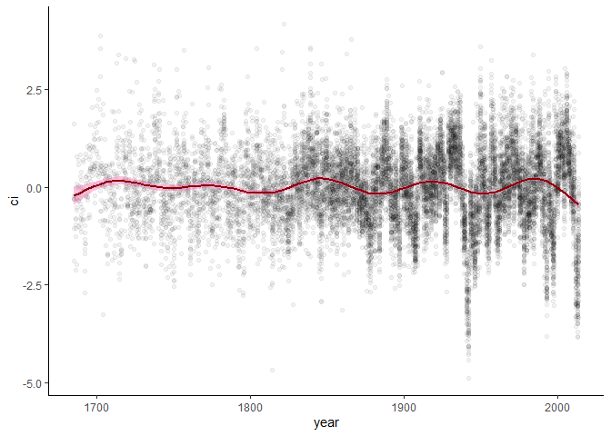
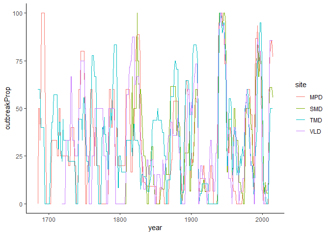

<!-- README.md is generated from README.Rmd. Please edit that file -->

outbreakR
=========

<!-- badges: start -->
<!-- badges: end -->

outbreakR provides simple tools to extract corrected indices and insect
outbreak reconstruction data from dendrochronological time series data.

Installation
------------

Install the development version from [GitHub](https://github.com/) with:

``` r
# install.packages("devtools")
devtools::install_github("toddellis/outbreakR")
```

Using outbreakR
---------------

`outbreakR` comes with two demo datasets:

1.  `ob_host`: A host dataset comprised of tree-level ring-width indices
    from Douglas-fir trees sampled across four study sites in 2014.
2.  `ob_nonhost`: A nonhost master chronology – the first principal
    component – built from ponderosa pine trees sampled across study
    sites from the same region.

``` r
library(outbreakR)
tibble::glimpse(ob_host)
#> Observations: 330
#> Variables: 69
#> $ year  <dbl> 1685, 1686, 1687, 1688, 1689, 1690,...
#> $ MPD01 <dbl> 0.6960065, 0.6897567, 1.0949695, 0....
#> $ MPD02 <dbl> NA, NA, NA, NA, NA, NA, NA, NA, NA,...
#> $ MPD03 <dbl> NA, NA, NA, NA, NA, NA, NA, NA, NA,...
#> $ MPD04 <dbl> NA, NA, NA, NA, NA, NA, NA, NA, NA,...
#> $ MPD05 <dbl> NA, NA, NA, NA, NA, NA, NA, NA, NA,...
#> $ MPD06 <dbl> NA, NA, NA, 0.5471116, 0.8128844, 0...
#> $ MPD07 <dbl> NA, NA, NA, NA, NA, NA, NA, NA, NA,...
#> $ MPD08 <dbl> NA, NA, NA, NA, NA, NA, NA, NA, NA,...
#> $ MPD09 <dbl> NA, NA, NA, NA, NA, NA, NA, NA, NA,...
#> $ MPD10 <dbl> NA, NA, NA, NA, NA, NA, NA, NA, NA,...
#> $ MPD11 <dbl> NA, NA, NA, NA, NA, NA, NA, NA, NA,...
#> $ MPD12 <dbl> NA, NA, NA, NA, NA, NA, NA, NA, NA,...
#> $ MPD14 <dbl> NA, NA, NA, NA, NA, NA, NA, NA, NA,...
#> $ MPD15 <dbl> 1.66321791, 0.56448535, 0.56984525,...
#> $ MPD16 <dbl> NA, NA, NA, NA, NA, NA, NA, NA, NA,...
#> $ SMD01 <dbl> NA, NA, NA, NA, NA, NA, NA, NA, NA,...
#> $ SMD02 <dbl> NA, NA, NA, NA, NA, NA, NA, NA, NA,...
#> $ SMD03 <dbl> NA, NA, NA, NA, NA, NA, NA, NA, NA,...
#> $ SMD04 <dbl> NA, NA, NA, NA, NA, NA, NA, NA, NA,...
#> $ SMD05 <dbl> NA, NA, NA, NA, NA, NA, NA, NA, NA,...
#> $ SMD06 <dbl> NA, NA, NA, NA, NA, NA, NA, NA, NA,...
#> $ SMD07 <dbl> NA, NA, NA, NA, NA, NA, NA, NA, NA,...
#> $ SMD08 <dbl> NA, NA, NA, NA, NA, NA, NA, NA, NA,...
#> $ SMD09 <dbl> NA, NA, NA, NA, NA, NA, NA, NA, NA,...
#> $ SMD10 <dbl> NA, NA, NA, NA, NA, NA, NA, NA, NA,...
#> $ SMD11 <dbl> NA, NA, NA, NA, NA, NA, NA, NA, NA,...
#> $ SMD12 <dbl> NA, NA, NA, NA, NA, NA, NA, NA, NA,...
#> $ SMD13 <dbl> NA, NA, NA, NA, NA, NA, NA, NA, NA,...
#> $ SMD14 <dbl> NA, NA, NA, NA, NA, NA, NA, NA, NA,...
#> $ SMD15 <dbl> NA, NA, NA, NA, NA, NA, NA, NA, NA,...
#> $ SMD16 <dbl> NA, NA, NA, NA, NA, NA, NA, NA, NA,...
#> $ SMD17 <dbl> NA, NA, NA, NA, NA, NA, NA, NA, NA,...
#> $ SMD18 <dbl> NA, NA, NA, NA, NA, NA, NA, NA, NA,...
#> $ TMD01 <dbl> 0.3331848, 0.3211430, 0.1771122, 0....
#> $ TMD02 <dbl> NA, NA, NA, NA, NA, NA, NA, NA, NA,...
#> $ TMD03 <dbl> NA, NA, NA, NA, NA, NA, NA, NA, NA,...
#> $ TMD04 <dbl> 0.9105027, 0.7801712, 0.8838990, 0....
#> $ TMD05 <dbl> NA, NA, NA, NA, NA, NA, NA, NA, NA,...
#> $ TMD06 <dbl> NA, NA, NA, NA, NA, NA, NA, NA, NA,...
#> $ TMD07 <dbl> NA, NA, NA, NA, NA, NA, NA, NA, NA,...
#> $ TMD08 <dbl> NA, NA, NA, NA, NA, NA, NA, NA, NA,...
#> $ TMD09 <dbl> NA, NA, NA, NA, NA, NA, NA, NA, NA,...
#> $ TMD10 <dbl> NA, NA, NA, NA, NA, NA, NA, NA, NA,...
#> $ TMD11 <dbl> NA, NA, NA, NA, NA, NA, NA, NA, NA,...
#> $ TMD12 <dbl> 0.8555250, 0.6882582, 0.7302570, 0....
#> $ TMD13 <dbl> 0.8575240, 0.7379745, 0.8357733, 0....
#> $ TMD14 <dbl> NA, NA, NA, NA, NA, NA, NA, NA, NA,...
#> $ TMD15 <dbl> NA, NA, NA, NA, NA, NA, NA, NA, NA,...
#> $ TMD16 <dbl> 0.8227725, 0.9142322, 0.5854386, 0....
#> $ TMD17 <dbl> NA, NA, NA, NA, NA, NA, NA, NA, NA,...
#> $ TMD18 <dbl> NA, NA, NA, NA, NA, NA, NA, NA, NA,...
#> $ TMD19 <dbl> NA, NA, NA, NA, NA, NA, NA, NA, NA,...
#> $ TMD20 <dbl> NA, NA, NA, NA, NA, NA, NA, NA, NA,...
#> $ VLD01 <dbl> NA, NA, NA, NA, NA, NA, NA, NA, NA,...
#> $ VLD02 <dbl> NA, NA, NA, NA, NA, NA, NA, NA, NA,...
#> $ VLD03 <dbl> NA, NA, NA, NA, NA, NA, NA, NA, NA,...
#> $ VLD04 <dbl> NA, NA, NA, NA, NA, NA, NA, NA, NA,...
#> $ VLD05 <dbl> NA, NA, NA, NA, NA, NA, NA, NA, NA,...
#> $ VLD06 <dbl> NA, NA, NA, NA, NA, NA, NA, NA, NA,...
#> $ VLD07 <dbl> NA, NA, NA, NA, NA, NA, NA, NA, NA,...
#> $ VLD08 <dbl> NA, NA, NA, NA, NA, NA, NA, NA, NA,...
#> $ VLD09 <dbl> NA, NA, NA, NA, NA, NA, NA, NA, NA,...
#> $ VLD10 <dbl> NA, NA, NA, NA, NA, NA, NA, NA, NA,...
#> $ VLD11 <dbl> NA, NA, NA, NA, NA, NA, NA, NA, NA,...
#> $ VLD12 <dbl> NA, NA, NA, NA, NA, NA, NA, NA, NA,...
#> $ VLD13 <dbl> NA, NA, NA, NA, NA, NA, NA, NA, NA,...
#> $ VLD14 <dbl> NA, NA, NA, NA, NA, NA, NA, NA, NA,...
#> $ VLD15 <dbl> NA, NA, NA, NA, NA, NA, NA, NA, NA,...
tibble::glimpse(ob_nonhost)
#> Observations: 330
#> Variables: 2
#> $ year    <dbl> 1685, 1686, 1687, 1688, 1689, 169...
#> $ nonhost <dbl> -0.10557403, 0.18276154, -0.65680...
```

### Corrected indices

To extract insect outbreak data, `outbreakR` uses two simple functions.
The first produces **corrected indices** by removing climatic noise from
the host tree-level data, leaving an assumed biological signal.

The default settings assume wide-format data, as expected from the
output of `dplR`’s RWI functions.

Just be aware of the additional settings for `cor_index()`.

``` r
foo <- cor_index(ob_host, ob_nonhost)

head(foo)
#> # A tibble: 6 x 5
#> # Groups:   tree_id [1]
#>    year tree_id  host nonhost     ci
#>   <dbl> <chr>   <dbl>   <dbl>  <dbl>
#> 1  1685 MPD01   0.696  -0.106 -1.05 
#> 2  1686 MPD01   0.690   0.183 -1.25 
#> 3  1687 MPD01   1.09   -0.657  0.782
#> 4  1688 MPD01   0.844  -1.97   0.678
#> 5  1689 MPD01   1.15   -0.360  0.818
#> 6  1690 MPD01   0.695  -1.45  -0.203
```

As an alternative, it also takes long-format data:

``` r
ob_host %>%
  gather('id', 'rwi', -year) %>%
  cor_index(., 
            ob_nonhost,
            format = 'long') %>%
  head()
#> # A tibble: 6 x 5
#> # Groups:   tree_id [1]
#>    year tree_id  host nonhost     ci
#>   <dbl> <chr>   <dbl>   <dbl>  <dbl>
#> 1  1685 MPD01   0.696  -0.106 -1.05 
#> 2  1686 MPD01   0.690   0.183 -1.25 
#> 3  1687 MPD01   1.09   -0.657  0.782
#> 4  1688 MPD01   0.844  -1.97   0.678
#> 5  1689 MPD01   1.15   -0.360  0.818
#> 6  1690 MPD01   0.695  -1.45  -0.203
```

Many dendrochronological datasets come in wide format rather than long,
and treat years as the row names. This can also be handled here, but
it’s really recommended that you avoid deprecated data formats like
this:

``` r
## Reformat both host and nonhost to mimic older formatting
host_old <- ob_host %>%
  as.data.frame()
row.names(host_old) <- host_old$year
host_old <- host_old %>%
  dplyr::select(-year)

nonhost_old <- ob_nonhost %>%
  as.data.frame()
row.names(nonhost_old) <- nonhost_old$year
nonhost_old <- nonhost_old %>%
  dplyr::select(-year)

head(host_old)
#>          MPD01 MPD02 MPD03 MPD04 MPD05     MPD06
#> 1685 0.6960065    NA    NA    NA    NA        NA
#> 1686 0.6897567    NA    NA    NA    NA        NA
#> 1687 1.0949695    NA    NA    NA    NA        NA
#> 1688 0.8440234    NA    NA    NA    NA 0.5471116
#> 1689 1.1547135    NA    NA    NA    NA 0.8128844
#> 1690 0.6954994    NA    NA    NA    NA 0.2642121
#>      MPD07 MPD08 MPD09 MPD10 MPD11 MPD12 MPD14
#> 1685    NA    NA    NA    NA    NA    NA    NA
#> 1686    NA    NA    NA    NA    NA    NA    NA
#> 1687    NA    NA    NA    NA    NA    NA    NA
#> 1688    NA    NA    NA    NA    NA    NA    NA
#> 1689    NA    NA    NA    NA    NA    NA    NA
#> 1690    NA    NA    NA    NA    NA    NA    NA
#>          MPD15 MPD16 SMD01 SMD02 SMD03 SMD04 SMD05
#> 1685 1.6632179    NA    NA    NA    NA    NA    NA
#> 1686 0.5644853    NA    NA    NA    NA    NA    NA
#> 1687 0.5698452    NA    NA    NA    NA    NA    NA
#> 1688 0.5048660    NA    NA    NA    NA    NA    NA
#> 1689 0.4808650    NA    NA    NA    NA    NA    NA
#> 1690 0.3278609    NA    NA    NA    NA    NA    NA
#>      SMD06 SMD07 SMD08 SMD09 SMD10 SMD11 SMD12 SMD13
#> 1685    NA    NA    NA    NA    NA    NA    NA    NA
#> 1686    NA    NA    NA    NA    NA    NA    NA    NA
#> 1687    NA    NA    NA    NA    NA    NA    NA    NA
#> 1688    NA    NA    NA    NA    NA    NA    NA    NA
#> 1689    NA    NA    NA    NA    NA    NA    NA    NA
#> 1690    NA    NA    NA    NA    NA    NA    NA    NA
#>      SMD14 SMD15 SMD16 SMD17 SMD18     TMD01 TMD02
#> 1685    NA    NA    NA    NA    NA 0.3331848    NA
#> 1686    NA    NA    NA    NA    NA 0.3211430    NA
#> 1687    NA    NA    NA    NA    NA 0.1771122    NA
#> 1688    NA    NA    NA    NA    NA 0.2139429    NA
#> 1689    NA    NA    NA    NA    NA 0.5547610    NA
#> 1690    NA    NA    NA    NA    NA 0.3930280    NA
#>      TMD03     TMD04 TMD05 TMD06 TMD07 TMD08 TMD09
#> 1685    NA 0.9105027    NA    NA    NA    NA    NA
#> 1686    NA 0.7801712    NA    NA    NA    NA    NA
#> 1687    NA 0.8838990    NA    NA    NA    NA    NA
#> 1688    NA 0.7627637    NA    NA    NA    NA    NA
#> 1689    NA 0.9994772    NA    NA    NA    NA    NA
#> 1690    NA 0.7515191    NA    NA    NA    NA    NA
#>      TMD10 TMD11     TMD12     TMD13 TMD14 TMD15
#> 1685    NA    NA 0.8555250 0.8575240    NA    NA
#> 1686    NA    NA 0.6882582 0.7379745    NA    NA
#> 1687    NA    NA 0.7302570 0.8357733    NA    NA
#> 1688    NA    NA 0.4114042 0.4655927    NA    NA
#> 1689    NA    NA 0.6241529 0.7525962    NA    NA
#> 1690    NA    NA 0.4646850 0.6197168    NA    NA
#>          TMD16 TMD17 TMD18 TMD19 TMD20 VLD01 VLD02
#> 1685 0.8227725    NA    NA    NA    NA    NA    NA
#> 1686 0.9142322    NA    NA    NA    NA    NA    NA
#> 1687 0.5854386    NA    NA    NA    NA    NA    NA
#> 1688 0.3042688    NA    NA    NA    NA    NA    NA
#> 1689 0.8982428    NA    NA    NA    NA    NA    NA
#> 1690 0.7747778    NA    NA    NA    NA    NA    NA
#>      VLD03 VLD04 VLD05 VLD06 VLD07 VLD08 VLD09 VLD10
#> 1685    NA    NA    NA    NA    NA    NA    NA    NA
#> 1686    NA    NA    NA    NA    NA    NA    NA    NA
#> 1687    NA    NA    NA    NA    NA    NA    NA    NA
#> 1688    NA    NA    NA    NA    NA    NA    NA    NA
#> 1689    NA    NA    NA    NA    NA    NA    NA    NA
#> 1690    NA    NA    NA    NA    NA    NA    NA    NA
#>      VLD11 VLD12 VLD13 VLD14 VLD15
#> 1685    NA    NA    NA    NA    NA
#> 1686    NA    NA    NA    NA    NA
#> 1687    NA    NA    NA    NA    NA
#> 1688    NA    NA    NA    NA    NA
#> 1689    NA    NA    NA    NA    NA
#> 1690    NA    NA    NA    NA    NA

## Specify years_as_rownames = TRUE
cor_index(host_old, nonhost_old, years_as_rownames = T) %>%
  head()
#> [1] "Please avoid using years as rownames."
#> # A tibble: 6 x 5
#> # Groups:   tree_id [1]
#>    year tree_id  host nonhost     ci
#>   <dbl> <chr>   <dbl>   <dbl>  <dbl>
#> 1  1685 MPD01   0.696  -0.106 -1.05 
#> 2  1686 MPD01   0.690   0.183 -1.25 
#> 3  1687 MPD01   1.09   -0.657  0.782
#> 4  1688 MPD01   0.844  -1.97   0.678
#> 5  1689 MPD01   1.15   -0.360  0.818
#> 6  1690 MPD01   0.695  -1.45  -0.203

foo %>%
  ggplot(aes(x = year, y = ci)) +
  theme_classic() +
  geom_point(alpha = 0.05) +
  geom_smooth(method = 'gam', 
              formula = y ~ s(x, k = 12),
              color = 'darkred',
              fill = 'hotpink')
```



### Outbreak reconstructions

The `outbreak` function extracts either binary outbreak/non-outbreak
time series data at the tree level, or produces proportional outbreaks
showing the percentage of trees with an outbreak in a given year.

``` r
outbreak(foo) %>%
  tail(10)
#> # A tibble: 10 x 2
#>     year outbreakProp
#>    <dbl>        <dbl>
#>  1  2005         2.99
#>  2  2006         2.99
#>  3  2007         2.99
#>  4  2008         5.97
#>  5  2009        40.3 
#>  6  2010        65.7 
#>  7  2011        67.2 
#>  8  2012        68.2 
#>  9  2013        68.2 
#> 10  2014        64.6

outbreak(foo, prop = FALSE) %>%
  tail(10)
#> # A tibble: 10 x 9
#>     year tree_id  host nonhost      ci conYrs
#>    <dbl> <chr>   <dbl>   <dbl>   <dbl>  <dbl>
#>  1  2005 VLD15   0.699  -0.624 -0.494       2
#>  2  2006 VLD15   0.864  -2.29   1.18        3
#>  3  2007 VLD15   0.427  -2.53  -0.0447      4
#>  4  2008 VLD15   0.617  -1.95   0.161       5
#>  5  2009 VLD15   0.652  -1.23  -0.224       6
#>  6  2010 VLD15   0.858   0.626 -0.854       7
#>  7  2011 VLD15   1.01    0.480 -0.276       8
#>  8  2012 VLD15   0.409   2.14  -3.32        9
#>  9  2013 VLD15   0.482   2.52  -3.35       10
#> 10  2014 VLD15   0.972   1.77  -1.28       11
#> # ... with 3 more variables: outbreakBinary <dbl>,
#> #   obGroups <dbl>, outbreak <dbl>
```

We can extract the sites here and run it individually per site. I may
try to implement this in the future, but for now, this would provide a
workaround:

``` r
## add site variable
foo <- foo %>%
  mutate(site = substr(tree_id, 1, 3)) 
## pull out unique sites
sites <- foo %>%
  .$site %>%
  unique()

## create empty list to fill
site_outbreaks <- list()

## loop through site list
for (i in 1:length(sites)) {
  site_outbreaks[[i]] <- foo %>%
    filter(site == sites[i]) %>%
    outbreak() %>%
    mutate(site = sites[i])
}

site_outbreaks <- bind_rows(site_outbreaks)

site_outbreaks %>%
  ggplot(aes(x = year, y = outbreakProp, color = site)) +
  geom_line() +
  theme_classic()
```



Quite hideous at this stage, but will be fixed a bit in the next update.
